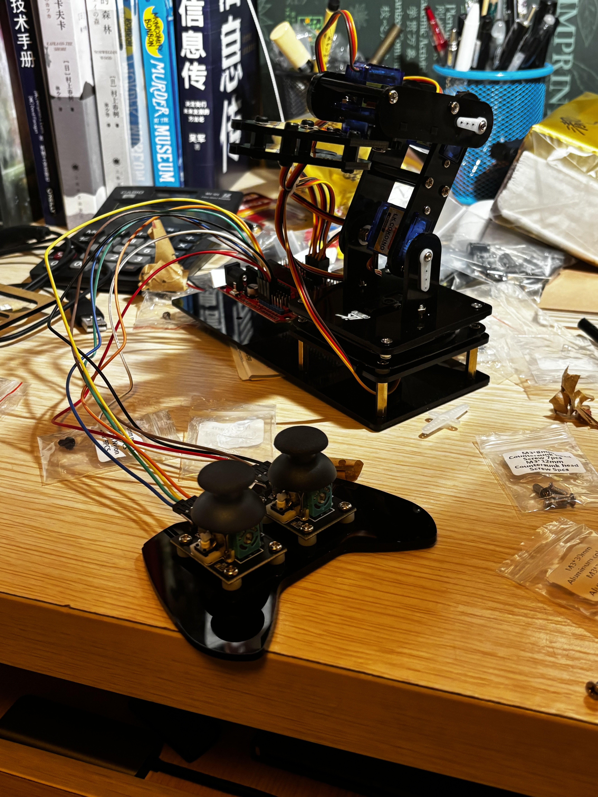
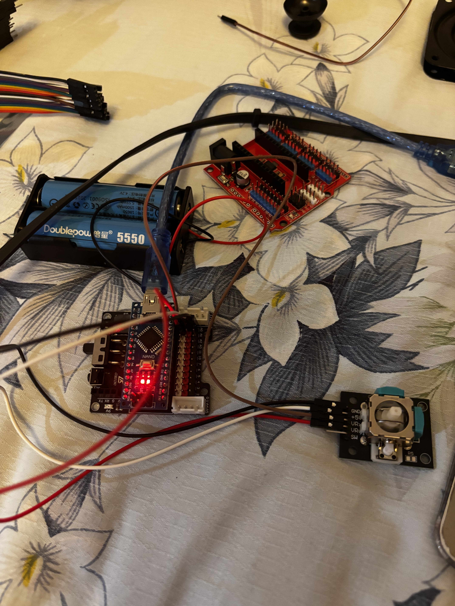

# Three Joint Robotic Arm with Real-time Stabilization
Replace this text with a brief description (2-3 sentences) of your project. This description should draw the reader in and make them interested in what you've built. You can include what the biggest challenges, takeaways, and triumphs from completing the project were. As you complete your portfolio, remember your audience is less familiar than you are with all that your project entails!

You should comment out all portions of your portfolio that you have not completed yet, as well as any instructions:
```HTML 
<!--- This is an HTML comment in Markdown -->
<!--- Anything between these symbols will not render on the published site -->
```

| **Engineer** | **School** | **Area of Interest** | **Grade** |
|:--:|:--:|:--:|:--:|
| Ian Q | Cranbrook Schools | Engineering | Incoming Junior
  
# Final Milestone

**Don't forget to replace the text below with the embedding for your milestone video. Go to Youtube, click Share -> Embed, and copy and paste the code to replace what's below.**

<iframe width="560" height="315" src="https://www.youtube.com/embed/F7M7imOVGug" title="YouTube video player" frameborder="0" allow="accelerometer; autoplay; clipboard-write; encrypted-media; gyroscope; picture-in-picture; web-share" allowfullscreen></iframe>

For your final milestone, explain the outcome of your project. Key details to include are:
- What you've accomplished since your previous milestone
- What your biggest challenges and triumphs were at BSE
- A summary of key topics you learned about
- What you hope to learn in the future after everything you've learned at BSE


# Second Milestone

**Don't forget to replace the text below with the embedding for your milestone video. Go to Youtube, click Share -> Embed, and copy and paste the code to replace what's below.**

<iframe width="560" height="315" src="https://www.youtube.com/embed/y3VAmNlER5Y" title="YouTube video player" frameborder="0" allow="accelerometer; autoplay; clipboard-write; encrypted-media; gyroscope; picture-in-picture; web-share" allowfullscreen></iframe>

Improving on the original design, I replaced the slow mg90s servo with es08md II, allowing higher torque and precision. The es08md II cartridge is slightly larger than the reserved servo space, so the space had to be sanded. I made the process more efficient by using sand paper attached to an electric drill. As a result of this, servo 2 is now capable of handling the arm’s weight. 

I installed a mpu6050 imu module at the base of the robotic arm, which is able to measure the acceleration of x, y and z. This would detect the pitch and yaw of the base, which the servo would respond accordingly. The imu is plugged in analog port 4 and 5.

As my Arduino IDE has some issue handling the mpu6050 library, the data is sent through the Wire library.

When the imu detects changes in yaw, the arm uses direct angle compensation and returns to the original direction. 
E.g. when the base turns left 10 degrees, the arm turns right 10 degrees.
Due to the inaccuracy (signal noise) of the mpu6050, in the initial testing of the code, the arm slowly tilts to one side over time. This is resolved by giving the arm a “deadzone” so that it wouldn’t turn when the change in yaw is negligible.

I have two codes for stabilization - elbow segment stabilization and point stabilization

Elbow segment stabilization uses direct angle compensation to make sure that the angle which the elbow segment points towards remains constant despite changes in pitch. The Arduino obtains the base pitch from the imu, and uses it to obtain the difference between target angle and actual angle. It then uses the difference in angles as the input for servos, so that the elbow segment point in the same angle. After testing, I observed that the elbow adjusts too little, so I added a multiplier of 2.1 (tested value) to the elbow angle.

For point stabilization, when the imu detects changes in pitch, the arm instead uses inverse kinematics. The arm first calculates the distance from the base to the tip of the claw T through the target x and y, and calculates the angle opposite to T via law of cosine and the length of the two arm segments. With that angle, the arm adjusts its servo angle of the elbow, servo 3. The code also calculates the angle of elevation of t, and uses it to compute the servo angle for the shoulder, servo 2. As a result, the arm is able to have its tip at the same spot, regardless of yaw and pitch. As the imu is placed imperfectly in the base of the arm instead of where the shoulder servo is, I added constants “shoulder offset v” and “shoulder offset h”, which is accounted for in calculating actual pitch and yaw. 

# First Milestone

**Don't forget to replace the text below with the embedding for your milestone video. Go to Youtube, click Share -> Embed, and copy and paste the code to replace what's below.**

<iframe width="560" height="315" src="https://www.youtube.com/embed/CaCazFBhYKs" title="YouTube video player" frameborder="0" allow="accelerometer; autoplay; clipboard-write; encrypted-media; gyroscope; picture-in-picture; web-share" allowfullscreen></iframe>



I built this robotic arm step-by-step using an Arduino Nano microcontroller mounted on top of a Nano Shield, which handles the 9V battery needed to power the four motors. Before assembling any of the physical structure, I ran a calibration sketch to force all the servos to exactly 90 degrees. This allowed me to screw the plastic frame pieces on straight, ensuring the arm has an accurate center position.



To make the arm interactive, I wired up the joystick module that reads physical movements and translates them into motor commands for the arm.

Assembly & Hardware Challenges:

Shield Mounting Issues: Because the new red Nano Shield is shaped differently than the original, I could only securely install one support column to hold it above the base. Trying to use all four columns would press the metal standoffs against the exposed board pins, risking a short circuit.

Damaged Claw Gears: One of the teeth on the claw was unfortunately broken right out of the package. This missing tooth causes the gears to occasionally slip and lose alignment when trying to pick things up.

Weak Gripper Strength: The claw servo does not produce enough torque to tightly clamp down and hold onto objects securely.

Arm Weight Strain: Servo 2 has to lift the entire weight of the upper arm assembly. Because it is under-powered for this load, the arm's upward and downward movements are stuttered rather than smooth.

# Schematics 
Here's where you'll put images of your schematics. [Tinkercad](https://www.tinkercad.com/blog/official-guide-to-tinkercad-circuits) and [Fritzing](https://fritzing.org/learning/) are both great resoruces to create professional schematic diagrams, though BSE recommends Tinkercad becuase it can be done easily and for free in the browser. 

# Code
Here's where you'll put your code. The syntax below places it into a block of code. Follow the guide [here]([url](https://www.markdownguide.org/extended-syntax/)) to learn how to customize it to your project needs. 

```c++
void setup() {
  // put your setup code here, to run once:
  Serial.begin(9600);
  Serial.println("Hello World!");
}

void loop() {
  // put your main code here, to run repeatedly:

}
```

# Bill of Materials
Here's where you'll list the parts in your project. To add more rows, just copy and paste the example rows below.
Don't forget to place the link of where to buy each component inside the quotation marks in the corresponding row after href =. Follow the guide [here]([url](https://www.markdownguide.org/extended-syntax/)) to learn how to customize this to your project needs. 

| **Part** | **Note** | **Price** | **Link** |
|:--:|:--:|:--:|:--:|
| Item Name | What the item is used for | $Price | <a href="https://www.amazon.com/Arduino-A000066-ARDUINO-UNO-R3/dp/B008GRTSV6/"> Link </a> |
| Item Name | What the item is used for | $Price | <a href="https://www.amazon.com/Arduino-A000066-ARDUINO-UNO-R3/dp/B008GRTSV6/"> Link </a> |
| Item Name | What the item is used for | $Price | <a href="https://www.amazon.com/Arduino-A000066-ARDUINO-UNO-R3/dp/B008GRTSV6/"> Link </a> |

# Other Resources/Examples
One of the best parts about Github is that you can view how other people set up their own work. Here are some past BSE portfolios that are awesome examples. You can view how they set up their portfolio, and you can view their index.md files to understand how they implemented different portfolio components.
- [Example 1](https://trashytuber.github.io/YimingJiaBlueStamp/)
- [Example 2](https://sviatil0.github.io/Sviatoslav_BSE/)
- [Example 3](https://arneshkumar.github.io/arneshbluestamp/)

To watch the BSE tutorial on how to create a portfolio, click here.
