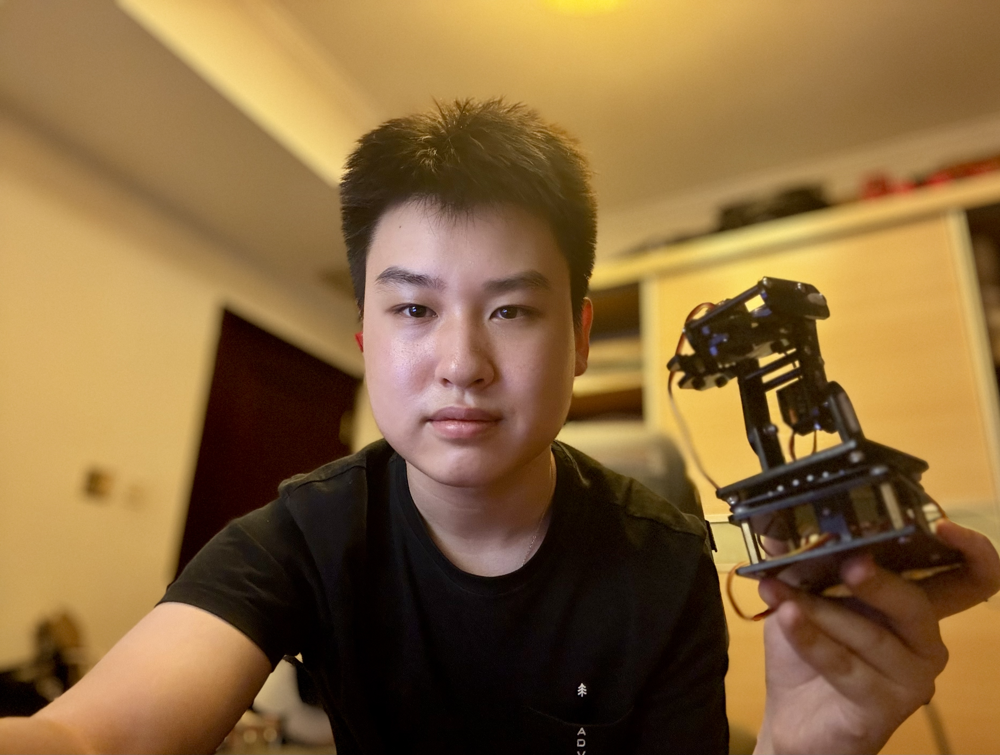
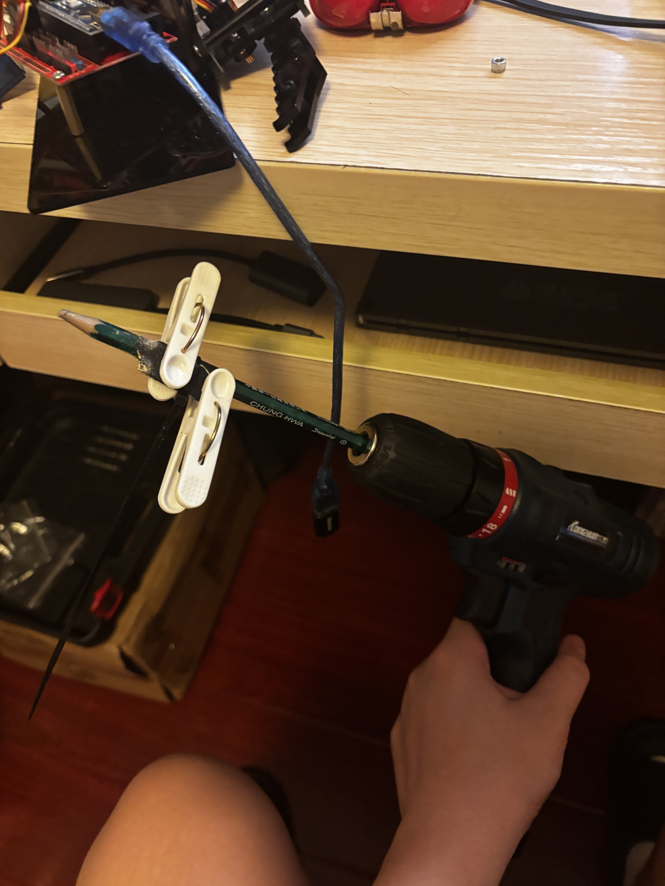
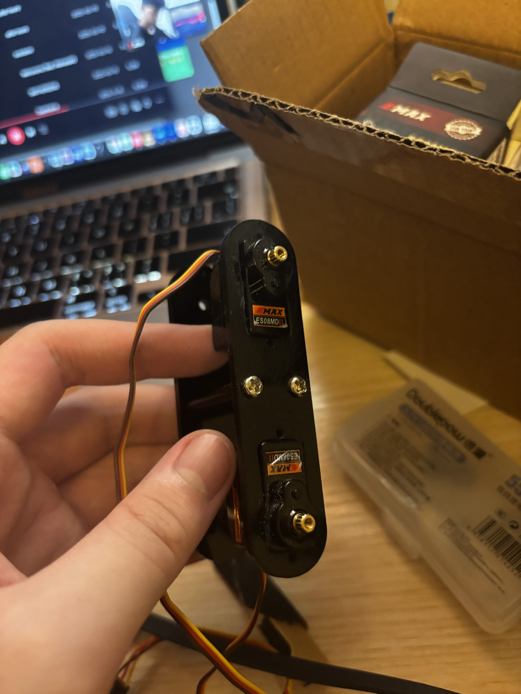
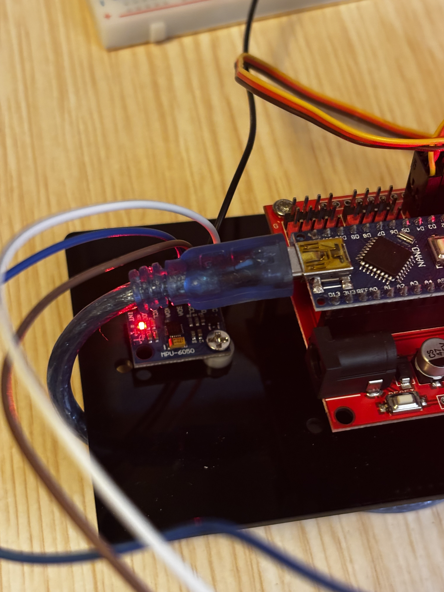
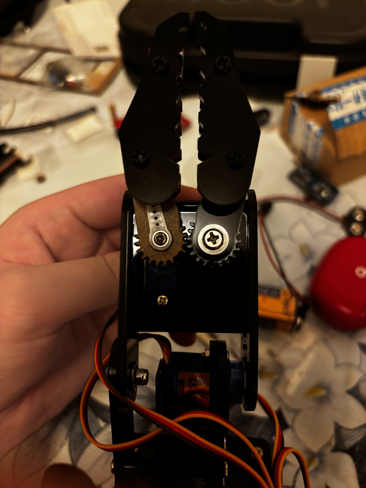
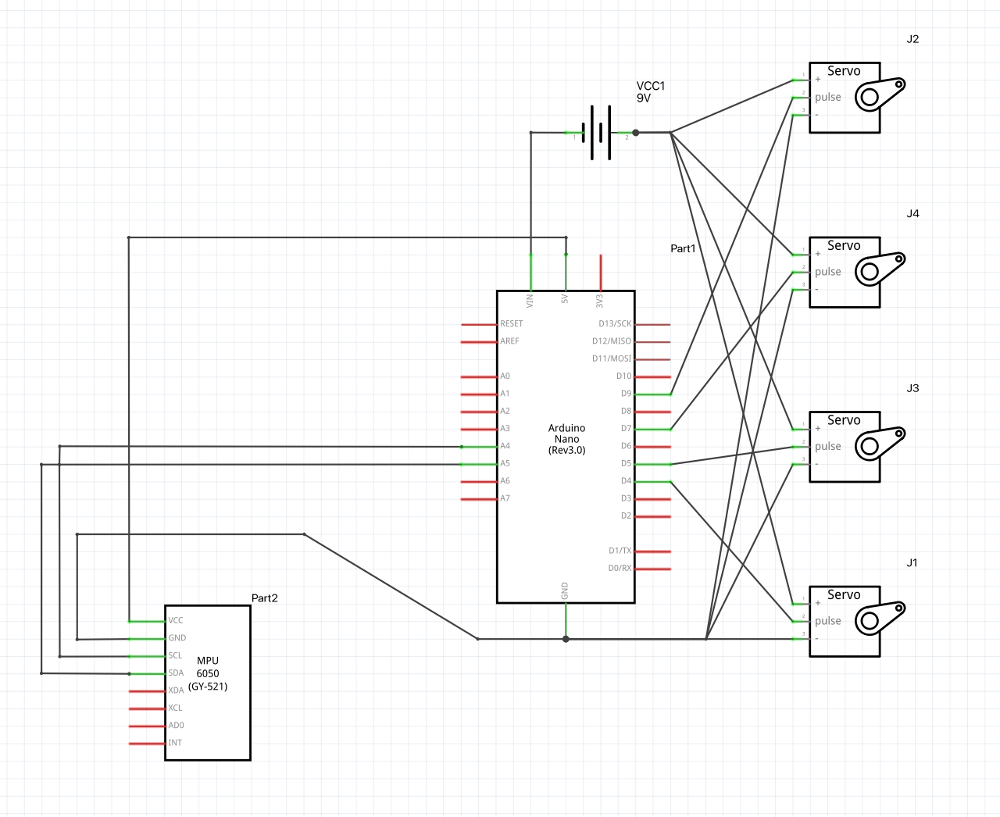
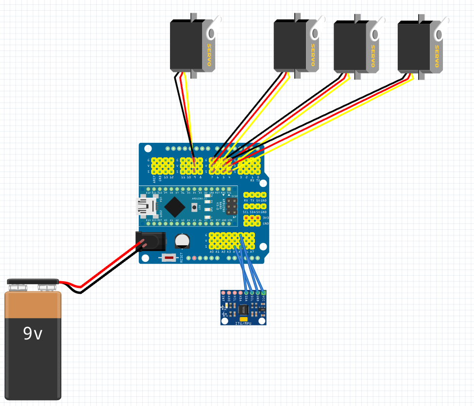

# Three Joint Robotic Arm with Real-time Stabilization

The base project is a three joint robotic arm powered by four mg90s servos controlled with a joystick. By utilizing input data from an IMU, the robotic arm is able to achieve active stabilization based on change in pitch and yaw.

| **Engineer** | **School** | **Area of Interest** | **Grade** |
|:--:|:--:|:--:|:--:|
| Ian Q | Cranbrook Schools | Engineering | Incoming Junior


  
# Final Milestone

I finalized the portfolio page and included the schematics of the robotic arm. The schematics diagram is created in Fritzing, as I was able to find ready to use resource for the Nano shield online. 

I also tuned the constants within the code, so that it could make more accurate stabilization. 

# Second Milestone

<iframe width="560" height="315" src="https://www.youtube.com/embed/woJGsZaEl8Q?si=6F8u63YiUSmT_Gih" title="YouTube video player" frameborder="0" allow="accelerometer; autoplay; clipboard-write; encrypted-media; gyroscope; picture-in-picture; web-share" referrerpolicy="strict-origin-when-cross-origin" allowfullscreen></iframe>


Improving on the original design, I replaced the slow mg90s servo with es08md II, allowing higher torque and precision. The es08md II cartridge is slightly larger than the reserved servo space, so the space had to be sanded. I made the process more efficient by using sand paper attached to an electric drill. The servo arm provided for the es08md II is also slightly smaller in diameter than the mg90s, so I had to glue to servo arm on the acrylic board. As a result of changing the servo, servo 2 is now capable of handling the arm’s weight. 





I installed a mpu6050 imu module at the base of the robotic arm, which is able to measure the acceleration of x, y and z. This would detect the pitch and yaw of the base, which the servo would respond accordingly. The imu is plugged in analog port 4 and 5.



As my Arduino IDE has some issue handling the mpu6050 library, the data is sent through the Wire library.

When the imu detects changes in yaw, the arm uses direct angle compensation and returns to the original direction. 
E.g. when the base turns left 10 degrees, the arm turns right 10 degrees.
Due to the inaccuracy (signal noise) of the mpu6050, in the initial testing of the code, the arm slowly tilts to one side over time. This is resolved by giving the arm a “deadzone” so that it wouldn’t turn when the change in yaw is negligible.

I have two codes for stabilization - elbow segment stabilization and point stabilization

Elbow segment stabilization uses direct angle compensation to make sure that the angle which the elbow segment points towards remains constant despite changes in pitch. The Arduino obtains the base pitch from the imu, and uses it to obtain the difference between target angle and actual angle. It then uses the difference in angles as the input for servos, so that the elbow segment point in the same angle. After testing, I observed that the elbow adjusts too little, so I added a multiplier of 2.1 (tested value) to the elbow angle.

For point stabilization, when the imu detects changes in pitch, the arm instead uses inverse kinematics. The arm first calculates the distance from the base to the tip of the claw T through the target x and y, and calculates the angle opposite to T via law of cosine and the length of the two arm segments. With that angle, the arm adjusts its servo angle of the elbow, servo 3. The code also calculates the angle of elevation of t, and uses it to compute the servo angle for the shoulder, servo 2. As a result, the arm is able to have its tip at the same spot, regardless of yaw and pitch. As the imu is placed imperfectly in the base of the arm instead of where the shoulder servo is, I added constants “shoulder offset v” and “shoulder offset h”, which is accounted for in calculating actual pitch and yaw. 

# First Milestone

<iframe width="560" height="315" src="https://www.youtube.com/embed/vZQ97c05rw8?si=-g4dH4Fxx19hnVv-" title="YouTube video player" frameborder="0" allow="accelerometer; autoplay; clipboard-write; encrypted-media; gyroscope; picture-in-picture; web-share" referrerpolicy="strict-origin-when-cross-origin" allowfullscreen></iframe>


I built this robotic arm step-by-step using an Arduino Nano microcontroller mounted on top of a Nano Shield, which handles the 9V battery needed to power the four motors. Before assembling any of the physical structure, I ran a calibration sketch to force all the servos to exactly 90 degrees. This allowed me to screw the plastic frame pieces on straight, ensuring the arm has an accurate center position.


To make the arm interactive, I wired up the joystick module that reads physical movements and translates them into motor commands for the arm.

Assembly & Hardware Challenges:

Shield Mounting Issues: Because the new red Nano Shield is shaped differently than the original, I could only securely install one support column to hold it above the base. Trying to use all four columns would press the metal standoffs against the exposed board pins, risking a short circuit.

Damaged Claw Gears: One of the teeth on the claw was unfortunately broken right out of the package. This missing tooth causes the gears to occasionally slip and lose alignment when trying to pick things up.



Weak Gripper Strength: The claw servo does not produce enough torque to tightly clamp down and hold onto objects securely.

Arm Weight Strain: Servo 2 has to lift the entire weight of the upper arm assembly. Because it is under-powered for this load, the arm's upward and downward movements are stuttered rather than smooth.

# Schematics 



# Code

Here is the code for the elbow stabilization:

```c++
#include <Wire.h>
#include <Servo.h>
#include <math.h>

const int MPU_ADDR = 0x68; 

Servo baseServo;     // pin 4
Servo shoulderServo; // pin 5
Servo elbowServo;    // pin 9
float basePitch = 0.0;
float baseYaw   = 0.0;
unsigned long lastTime;
// set the exact angle you want each joint to hold when the sensor is flat
const int RESTING_SHOULDER_DEG = 90; 
const int RESTING_ELBOW_DEG    = 150; 

void setup() {
  Wire.begin();
  Serial.begin(9600);
  // start mpu6050
  Wire.beginTransmission(MPU_ADDR);
  Wire.write(0x6B); 
  Wire.write(0);    
  Wire.endTransmission();
  // assign Pin
  baseServo.attach(4);
  shoulderServo.attach(5); 
  elbowServo.attach(9);    
  lastTime = millis();
}

void loop() {
  //record change in time (dt) for acceleration
  unsigned long currentTime = millis();
  float dt = (currentTime - lastTime) / 1000.0;
  lastTime = currentTime;

  //request data from imu
  Wire.beginTransmission(MPU_ADDR);
  Wire.write(0x3B); 
  Wire.endTransmission(false);
  Wire.requestFrom(MPU_ADDR, 14, true);

  //obtain data from imu
  //communication bus can only send 8 bits but the accelerometer readings are 16 bit signed int
  //the code reads the first byte (the "high" part) and uses << 8 to shift its bits 8 spaces to the left, creating room on the right of zeros
  //it then uses the or operator to slot the second byte directly into that empty space, merging them into a single signed integer (int16_t)

  int16_t ax = (Wire.read() << 8) | Wire.read();
  int16_t ay = (Wire.read() << 8) | Wire.read();
  int16_t az = (Wire.read() << 8) | Wire.read();
  Wire.read(); Wire.read(); // Skip temp bytes
  int16_t gx = (Wire.read() << 8) | Wire.read();
  int16_t gy = (Wire.read() << 8) | Wire.read();
  int16_t gz = (Wire.read() << 8) | Wire.read();

  // process pitch and yaw
  float accelPitch = atan2(ay, az) * 180.0 / M_PI;//use trig to calculate the pitch angle using the accelerometer y and z axes, then converts the result from radians to degrees
  float gyroXRate = gx / 131.0;  //converts the raw gyroscope data into degrees per second - pitch
  //131.0 is a scale factor from the mpu6050 datasheet based on its default sensitivity setting
  float gyroZRate = gz / 131.0; //yaw

  basePitch = 0.98 * (basePitch + gyroXRate * dt) + 0.02 * accelPitch;
  
  // yaw deadzone
  if (abs(gyroZRate) < 3.0) { 
    gyroZRate = 0.0; 
  }
  baseYaw += gyroZRate * dt; 
  int shoulderDynamicAdjust = basePitch; 
  // multiply the pitch to make the elbow move more aggressively and with more extension. 
  // 2.1 means it will move 110% further than before. This value is obtained after trying different values.
  float elbowMultiplier = 2.1; 
  int elbowDynamicAdjust = basePitch * elbowMultiplier; 
  // calculate adjust angles
  int shoulderServoDeg = RESTING_SHOULDER_DEG - shoulderDynamicAdjust;
  int elbowServoDeg    = RESTING_ELBOW_DEG + elbowDynamicAdjust; 
  int baseServoDeg     = 90 - baseYaw;
  // shoulder degrees had to be inversed due to structural placement
  shoulderServoDeg = 180 - shoulderServoDeg; 
  // safety limit for each servo
  baseServoDeg     = constrain(baseServoDeg, 10, 170);
  shoulderServoDeg = constrain(shoulderServoDeg, 15, 165);
  elbowServoDeg    = constrain(elbowServoDeg, 15, 165);
  // for testing: Print angle data in monitor
  Serial.print("IMU Pitch: "); Serial.print(basePitch);
  Serial.print(" | Shoulder: "); Serial.print(shoulderServoDeg);
  Serial.print(" | Elbow: "); Serial.println(elbowServoDeg);
  // write the result to servos
  baseServo.write(baseServoDeg);
  shoulderServo.write(shoulderServoDeg);
  elbowServo.write(elbowServoDeg);

  delay(15);
}
```

Here is the code for the point stabilization:

```c++
#include <Wire.h>
#include <Servo.h>
#include <math.h>

const int MPU_ADDR = 0x68; 

const float L1 = 60.0;                 
const float L2 = 90.0;                 
const float SHOULDER_OFFSET_V = 110.0;  // offset of imu in length
const float SHOULDER_OFFSET_H = 90.0;  // offset of imu in height

const float TARGET_X = 100.0;          
const float TARGET_Y = 100.0;           

Servo baseServo;     // Pin 4
Servo shoulderServo; // Pin 5
Servo elbowServo;    // Pin 9
float basePitch = 0.0;
float baseYaw   = 0.0;
unsigned long lastTime;

void setup() {
  Wire.begin();
  Serial.begin(9600);

  // start mpu6050
  Wire.beginTransmission(MPU_ADDR);
  Wire.write(0x6B); 
  Wire.write(0);    
  Wire.endTransmission();

  // assign pin
  baseServo.attach(4);
  shoulderServo.attach(5); 
  elbowServo.attach(9);    

  lastTime = millis();
}

void loop() {
  //record change in time (dt) for acceleration
  unsigned long currentTime = millis();
  float dt = (currentTime - lastTime) / 1000.0;
  lastTime = currentTime;

  //request data from imu
  Wire.beginTransmission(MPU_ADDR);
  Wire.write(0x3B); 
  Wire.endTransmission(false);
  Wire.requestFrom(MPU_ADDR, 14, true);

  //obtain data from imu
  //communication bus can only send 8 bits but the accelerometer readings are 16 bit signed int
  //the code reads the first byte (the "high" part) and uses << 8 to shift its bits 8 spaces to the left, creating room on the right of zeros
  //it then uses the or operator to slot the second byte directly into that empty space, merging them into a single signed integer (int16_t)
  int16_t ax = (Wire.read() << 8) | Wire.read();
  int16_t ay = (Wire.read() << 8) | Wire.read();
  int16_t az = (Wire.read() << 8) | Wire.read();
  Wire.read(); Wire.read(); // Skip temperature bytes
  int16_t gx = (Wire.read() << 8) | Wire.read();
  int16_t gy = (Wire.read() << 8) | Wire.read();
  int16_t gz = (Wire.read() << 8) | Wire.read();

  // process pitch and yaw
  float accelPitch = atan2(ay, az) * 180.0 / M_PI;//use trig to calculate the pitch angle using the accelerometer y and z axes, then converts the result from radians to degrees
  float gyroXRate = gx / 131.0;  //converts the raw gyroscope data into degrees per second - pitch
  //131.0 is a scale factor from the mpu6050 datasheet based on its default sensitivity setting
  float gyroZRate = gz / 131.0; //yaw

  basePitch = 0.98 * (basePitch + gyroXRate * dt) + 0.02 * accelPitch;
  
  // deadzone for yaw
  if (abs(gyroZRate) < 3.0) { 
    gyroZRate = 0.0; 
  }
  baseYaw += gyroZRate * dt; 

  float pitchRad = basePitch * M_PI / 180.0;//convert to radians for trig
  float absPitchRad = abs(basePitch) * M_PI / 180.0;//convert absolute pitch to radians

  // Vertical structural tracking
  float vertShiftX = SHOULDER_OFFSET_V * sin(pitchRad);
  float vertShiftY = SHOULDER_OFFSET_V * cos(pitchRad);

  // Absolute horizontal tracking to handle cross-zero pitch transitions
  float horizShiftX = SHOULDER_OFFSET_H * (1.0 - cos(absPitchRad));
  float horizShiftY = SHOULDER_OFFSET_H * sin(absPitchRad);

  // Symmetrical vector combination
  float totalShoulderShiftX = vertShiftX + horizShiftX;
  float totalShoulderShiftY = (SHOULDER_OFFSET_V - vertShiftY) + horizShiftY; 

  // Compute final modified target coordinates
  float modifiedX = TARGET_X - totalShoulderShiftX; 
  float modifiedY = TARGET_Y - totalShoulderShiftY; 

  // Distance from shoulder joint to targeted point
  float T = sqrt(modifiedX * modifiedX + modifiedY * modifiedY);

  // law of cosine to obtain internal angle of two arm segments
  float cosElbow = (L1 * L1 + L2 * L2 - T * T) / (2.0 * L1 * L2);
  cosElbow = constrain(cosElbow, -1.0, 1.0); // limit domain for arccos
  float elbowRad = acos(cosElbow);
  
  float cosShoulderInternal = (L1 * L1 + T * T - L2 * L2) / (2.0 * L1 * T);
  cosShoulderInternal = constrain(cosShoulderInternal, -1.0, 1.0);//limit domain for arcsin
  float shoulderInternalRad = acos(cosShoulderInternal);
  
  float angleToTargetRad = atan2(modifiedY, modifiedX); //the angle of elevation of t

  float shoulderAngleRad = angleToTargetRad + shoulderInternalRad;
  float elbowAngleRad    = elbowRad; 

  // convert angles to degrees
  int shoulderServoDeg = shoulderAngleRad * 180.0 / M_PI;
  int elbowServoDeg    = elbowAngleRad * 180.0 / M_PI;
  int baseServoDeg     = 90 - baseYaw; 

  shoulderServoDeg = 180 - shoulderServoDeg; // Inverted to match frame mounting
  // Elbow inversion removed to fix over-rotation bug

  // constraints to prevent mechanical binding or striking horns
  baseServoDeg     = constrain(baseServoDeg, 10, 170);
  shoulderServoDeg = constrain(shoulderServoDeg, 15, 165);
  elbowServoDeg    = constrain(elbowServoDeg, 30, 150);

  // output angles for debug
  Serial.print("S-Angle: "); Serial.print(shoulderServoDeg);
  Serial.print(" | E-Angle: "); Serial.println(elbowServoDeg);

  // write commands to hardware
  baseServo.write(baseServoDeg);
  shoulderServo.write(shoulderServoDeg);
  elbowServo.write(elbowServoDeg);

  delay(15); 
}
```

# Bill of Materials

| **Part** | **Note** | **Price** | **Link** |
|:--:|:--:|:--:|:--:|
| LK COKOINO Three Joint Robotic Arm| Base Project Robotic Arm | $46.99 | <a href="https://www.amazon.com/LK-COKOINO-Compliment-Engineering-Technology/dp/B081FG1JQ1"> Link </a> |
| Nano I/O Expansion Sensor Shield | Nano Shield with 3 Pins | $10.99 | <a href="https://www.amazon.com/HiLetgo-Expansion-Sensor-Arduino-Duemilanove/dp/B07VQRCC8F"> Link </a> |
| Schrewdriver Set | Assembly | $6.39 | <a href="https://www.amazon.com/Small-Screwdriver-Set-Mini-Magnetic/dp/B08RYXKJW9/"> Link </a> |
| Electronic Components | Testing | $14.99 | <a href="https://www.amazon.com/Smraza-Electronics-Potentiometer-tie-Points-Breadboard/dp/B0B62RL725"> Link </a> |
| 9V Battery | Power Source | $12.69 | <a href="https://www.amazon.com/dp/B00MH4QM1S"> Link </a> |
| 9V Battery Connector | Power Cord | $5.99 | <a href="https://www.amazon.com/DZS-Elec-Connector-Experimental-5-5x2-1mm/dp/B07FDS11ZY"> Link </a> |
| ES08MD II Servo | Servo Replacement | $16.33 | <a href="https://www.amazon.com/ES08MD-Metal-Digital-Servo-Plastic/dp/B0CKRYK1RG"> Link </a> |
| MPU6050 | IMU | $11.79 | <a href="https://www.amazon.com/HiLetgo-MPU-6050-Accelerometer-Gyroscope-Converter/dp/B00LP25V1A?th=1"> Link </a> |

